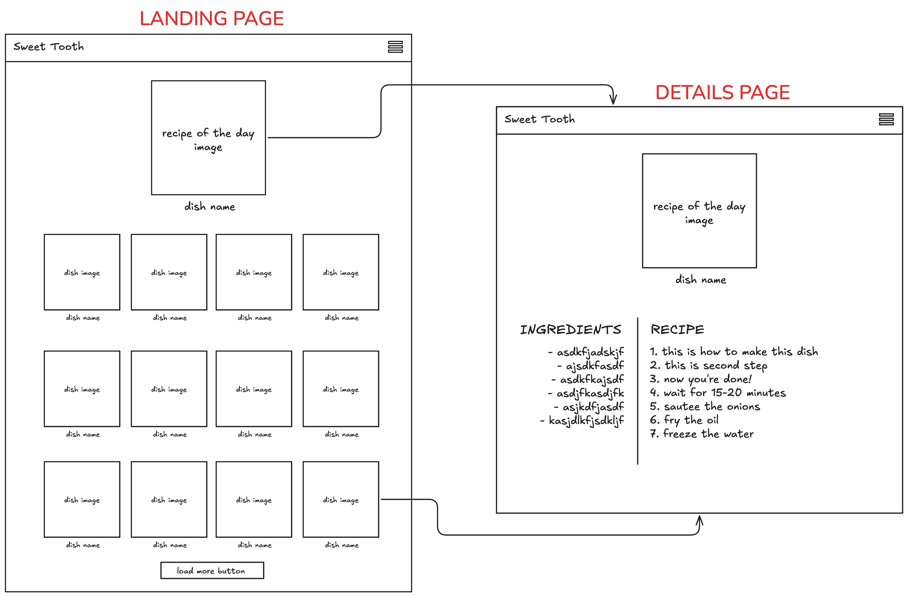

# Sweet Tooth
A [MarcyLabSchool](https://www.marcylabschool.org/) MOD4 Project

Contributors:
- [Xavier Hertzog](https://github.com/XavMontana)
- [Raffy Castillo](https://github.com/ffyruh)

Check out our [progress](https://github.com/orgs/mod4-x-raffy/projects/1) and [project proposal](https://docs.google.com/document/d/1jRYgCxhGpyYj7ASElt9mzVcjRPSn7LSwShSDklsMiZM/edit?usp=sharing).

## Running the app (_pending deployment_)
1. Move to the app directory with `cd app`
2. Install dependencies with `npm i`
3. Run the app locally with `npm run dev`

## Endpoints to Implement
[The MealDB](https://www.themealdb.com/api.php)
- Filter by category endpoint [Dessert] (https://themealdb.com/api/json/v1/1/filter.php?c={category})
- Lookup full meal details by id endpoint (https://themealdb.com/api/json/v1/1/lookup.php?i={id})

## User Stories

### MVP
- Users will be able to view images and names of desserts (main/landing page)
- Users will be able to view a recipe for a specific dessert (on click)
- Users will be able to go back to the main page after viewing a recipe
- Users will be able to view a recipe of day (random)
- Users will be able to load more recipes if they want to

### Stretch
- Users will be able to search recipes by name
- Users will be able to select a different category of recipes

## Wireframe

  

